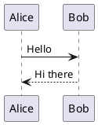

# Gitea with PlantUML and PostgreSQL

This repository contains a Docker Compose setup for running Gitea with PlantUML integration and PostgreSQL as the database backend.

## Overview

This setup includes:

- **Gitea**: A painless self-hosted Git service
- **PlantUML Server**: For rendering UML diagrams in Gitea markdown
- **PostgreSQL**: Database for Gitea

## Prerequisites

- Docker and Docker Compose installed
- Git

## Quick Start

1. Clone this repository:
   ```bash
   git clone https://github.com/igor-suhorukov/gitea-plantuml-pg.git
   cd gitea-plantuml-pg
   ```

2. Update the PostgreSQL password in `compose.yaml` (replace `YOUR_PG_PASSWORD` with a secure password)

3. Start the services:
   ```bash
   docker-compose up -d
   ```

4. Access Gitea at http://localhost:3008

## Services

### Gitea

- **Port**: 3008 (HTTP), 222 (SSH)
- **Data Directory**: `/gitea/data/gitea`
- **Config Directory**: `/gitea/data/config`

### PlantUML Server

- **Port**: 3080
- **URL**: http://localhost:3080

### PostgreSQL

- **Port**: 3432
- **Data Directory**: `/gitea/data/postgres`
- **Credentials**:
    - Username: gitea
    - Password: YOUR_PG_PASSWORD (change this)
    - Database: gitea

## PlantUML Integration

This setup includes custom JavaScript to render PlantUML diagrams in Gitea markdown. The integration works by:

1. Detecting code blocks with the `plantuml` language identifier
2. Converting the PlantUML code to a compressed format
3. Requesting the rendered diagram from the PlantUML server

### Example Usage

In your Gitea markdown files, you can create PlantUML diagrams like this:

````

````

## Configuration

### Custom Templates

The repository includes custom templates in the `gitea/custom` directory:

- `templates/custom/footer.tmpl`: Adds the PlantUML JavaScript to the footer
- `public/assets/js/`: Contains the JavaScript files for PlantUML rendering from [plantuml-code-highlight](https://gitea.com/davidsvantesson/plantuml-code-highlight)

### Volumes

- Gitea data: `/gitea/data/gitea`
- Gitea config: `/gitea/data/config`
- PostgreSQL data: `/gitea/data/postgres`
- Custom templates: `./gitea/custom:/data/gitea`